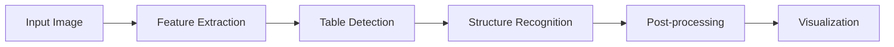

<div class="row">
    <div class="col-sm mt-3 mt-md-0">
        <div class="text-center">
            <a href="https://github.com/ShakilMahmudShuvo/Borderless-Tables-Detection" class="btn btn-sm btn-primary" target="_blank">
                <i class="fab fa-github"></i> View on GitHub
            </a>
            <a href="https://www.kaggle.com/code/shakilmahmudshuvo/borderless-table-detection" class="btn btn-sm btn-info" target="_blank">
                <i class="fab fa-kaggle"></i> View on Kaggle
            </a>
        </div>
    </div>
</div>

---

## Overview

This project implements a **borderless table detection system** using Hugging Face's Table Transformer model. The system is capable of detecting and extracting tables from images even when no visible borders are separating the rows and columns. It uses deep learning models to detect tables and their structure and visualizes the results by marking the tables, rows, and columns on the original image.

## Key Features

<div class="row mt-3">
    <div class="col-md-6">
        <div class="card h-100">
            <div class="card-body">
                <h5 class="card-title"><i class="fas fa-table text-primary"></i> Table Detection</h5>
                <p class="card-text">Identifies and locates tables within documents, even without visible borders.</p>
            </div>
        </div>
    </div>
    <div class="col-md-6">
        <div class="card h-100">
            <div class="card-body">
                <h5 class="card-title"><i class="fas fa-grip-horizontal text-success"></i> Structure Recognition</h5>
                <p class="card-text">Detects internal table structure including rows, columns, and spanning cells.</p>
            </div>
        </div>
    </div>
</div>

## Technical Approach

### 1. **Image Preprocessing**
- RGB format conversion for compatibility
- Image resizing to 50% for computational efficiency
- Feature extraction using `DetrFeatureExtractor`

### 2. **Model Architecture**
The project leverages two specialized models from Hugging Face:

<div class="row mt-3">
    <div class="col-md-12">
        <div class="card">
            <div class="card-body">
                <h5 class="card-title">Table Detection Model</h5>
                <p><code>microsoft/table-transformer-detection</code></p>
                <ul>
                    <li>ResNet backbone for local feature extraction</li>
                    <li>Transformer encoder-decoder for global context</li>
                    <li>Outputs bounding boxes around detected tables</li>
                </ul>
            </div>
        </div>
    </div>
</div>

<div class="row mt-2">
    <div class="col-md-12">
        <div class="card">
            <div class="card-body">
                <h5 class="card-title">Structure Recognition Model</h5>
                <p><code>microsoft/table-transformer-structure-recognition</code></p>
                <ul>
                    <li>DETR-based architecture with multi-head attention</li>
                    <li>Identifies rows, columns, and cell relationships</li>
                    <li>Handles complex structures including merged cells</li>
                </ul>
            </div>
        </div>
    </div>
</div>

### 3. **Inference Pipeline**



## Tools & Technologies

<div class="technology-section">
    <span class="badge bg-primary">Python</span>
    <span class="badge bg-success">PyTorch</span>
    <span class="badge bg-info">Hugging Face Transformers</span>
    <span class="badge bg-warning">Pillow (PIL)</span>
    <span class="badge bg-danger">OpenCV</span>
    <span class="badge bg-secondary">Jupyter Notebook</span>
</div>

## Results & Visualization

The system visualizes detection results by:
- Drawing bounding boxes around detected tables
- Highlighting individual rows and columns
- Using different colors to distinguish between structural elements
- Providing confidence scores for each detection

## Key Advantages

<div class="row mt-3">
    <div class="col-md-4">
        <div class="text-center">
            <i class="fas fa-eye-slash fa-3x text-primary mb-2"></i>
            <h6>Borderless Detection</h6>
            <p>Works on tables without visible borders or grid lines</p>
        </div>
    </div>
    <div class="col-md-4">
        <div class="text-center">
            <i class="fas fa-brain fa-3x text-success mb-2"></i>
            <h6>State-of-the-Art Models</h6>
            <p>Leverages pre-trained transformer models for high accuracy</p>
        </div>
    </div>
    <div class="col-md-4">
        <div class="text-center">
            <i class="fas fa-bolt fa-3x text-warning mb-2"></i>
            <h6>Quick Implementation</h6>
            <p>Ready-to-use solution without extensive custom training</p>
        </div>
    </div>
</div>

## Limitations & Future Work

- **Computational Resources**: Can be resource-intensive for large-scale deployment
- **Domain Adaptation**: May require fine-tuning for specialized table layouts
- **Complex Structures**: Performance can vary with highly irregular table formats

## How to Run

1. **Clone the Repository**:
   ```bash
   git clone https://github.com/ShakilMahmudShuvo/Borderless-Tables-Detection.git
   ```

2. **Install Dependencies**:
   ```bash
   pip install -r requirements.txt
   ```

3. **Run the Notebook**:
   - Open `borderless_table_detection.ipynb`
   - Execute cells sequentially
   - Use the Inference section for custom images

<div class="text-center mt-5">
    <a href="https://github.com/ShakilMahmudShuvo/Borderless-Tables-Detection" class="btn btn-primary" target="_blank">
        <i class="fab fa-github"></i> View Source Code
    </a>
</div>

<style>
.card {
    transition: transform 0.2s;
    border: 1px solid #dee2e6;
}
.card:hover {
    transform: translateY(-5px);
    box-shadow: 0 4px 8px rgba(0,0,0,0.1);
}
.technology-section {
    display: flex;
    flex-wrap: wrap;
    gap: 0.5rem;
    margin: 1rem 0;
}
.badge {
    font-size: 0.9rem;
    padding: 0.5rem 1rem;
}
</style> 