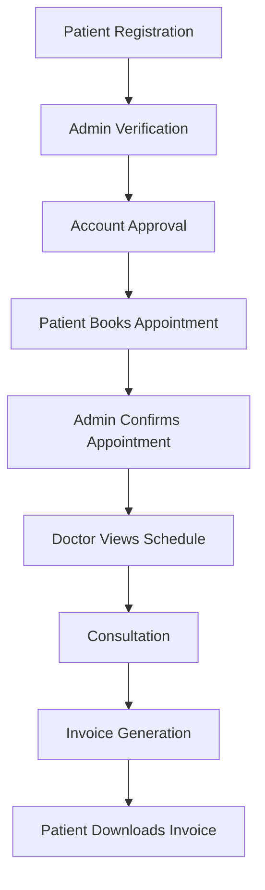

    

        

            <a href="https://github.com/ShakilMahmudShuvo/Doctor-Bhai" class="btn btn-sm btn-primary" target="_blank">
                <i class="fab fa-github"></i> View on GitHub
            </a>
        

    

---

## Overview

Doctor Bhai is a comprehensive healthcare assistance platform developed as part of the **CSE 3100** course at RUET. This user-friendly website was built using **Django**, **HTML**, **CSS**, and **JavaScript** to facilitate convenient appointment booking with doctors specifically in **Rajshahi, Bangladesh**.

The platform streamlines healthcare access by providing an integrated system for patients, doctors, and administrators to manage appointments, medical records, and emergency COVID-19 assistance.

### Tools & Technologies

`Django` `Python` `JavaScript` `HTML5` `CSS3` `SQLite` `Bootstrap` `jQuery`

---

## Features

The platform consists of **four main modules**:

### 👨‍💼 Admin Module
- **Authentication**: Secure login system
- **Account Management**: Verify and approve patient/doctor registrations
- **User Details**: View comprehensive patient and doctor information
- **Appointment Control**: Confirm appointments booked by patients
- **Billing**: Generate and manage invoices

### 👨‍⚕️ Doctor Module
- **Account Management**: Login/Sign Up functionality
- **Patient Information**: View assigned patient details (symptoms, name, contact)
- **Schedule Management**: View appointments booked by admin
- **Medical Records**: Access patient history and treatment details

### 🏥 Patient Module
- **Account Creation**: Easy Login/Sign Up process
- **Doctor Discovery**: View assigned doctor's specialization and contact details
- **Appointment Booking**: Book appointments with preferred doctors
- **Status Tracking**: Monitor appointment status (pending/confirmed)
- **Digital Invoices**: View and download invoice PDFs

### 🦠 COVID-19 Emergency Assistance
A dedicated section providing critical pandemic-related resources:

- **Information Hub**: Latest COVID-19 treatments and vaccination updates
- **Testing Centers**: Comprehensive directory of testing facilities in Rajshahi
- **Vaccination Points**: Updated list of vaccination centers
- **Emergency Resources**: 
  - Oxygen supplier contacts
  - Blood donor networks
  - Emergency helpline numbers

---

## System Workflow

---

## Key Functionalities

    

        

            

                <h5 class="card-title"><i class="fas fa-calendar-check text-primary"></i> Smart Appointment System</h5>
                
Automated scheduling with conflict detection and real-time availability updates

            

        

    

    

        

            

                <h5 class="card-title"><i class="fas fa-file-invoice text-success"></i> Digital Invoice Management</h5>
                
Automated invoice generation with PDF export functionality

            

        

    

    

        

            

                <h5 class="card-title"><i class="fas fa-user-shield text-warning"></i> Role-Based Access Control</h5>
                
Secure authentication with distinct permissions for patients, doctors, and admins

            

        

    

    

        

            

                <h5 class="card-title"><i class="fas fa-virus text-danger"></i> COVID-19 Resource Center</h5>
                
Real-time information on testing, vaccination, and emergency resources

            

        

    

---

## Technical Implementation

- **Backend**: Django REST Framework for API development
- **Frontend**: Responsive design using HTML5, CSS3, and JavaScript
- **Database**: SQLite for development, PostgreSQL-ready for production
- **Authentication**: Django's built-in authentication system with custom user roles
- **PDF Generation**: Dynamic invoice creation using Django PDF libraries

---

## Impact

Doctor Bhai addresses the critical need for streamlined healthcare access in Rajshahi, Bangladesh. By digitizing the appointment booking process and providing emergency COVID-19 resources, the platform:

- Reduces waiting times for patients
- Improves appointment management efficiency
- Provides crucial pandemic-related information
- Facilitates better doctor-patient communication

---

## Future Enhancements

- Integration with telemedicine capabilities
- Mobile application development
- SMS/Email notification system
- Multi-language support (Bengali/English)
- Payment gateway integration

---

    <a href="https://github.com/ShakilMahmudShuvo/Doctor-Bhai" class="btn btn-primary" target="_blank">
        <i class="fab fa-github"></i> View Source Code
    </a>

 