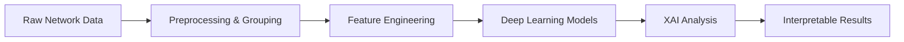

<div class="row">
    <div class="col-sm mt-3 mt-md-0">
        <div class="text-center">
            <a href="https://github.com/ShakilMahmudShuvo/Network-Intrusion-Detection-Using-XAI" class="btn btn-sm btn-primary" target="_blank">
                <i class="fab fa-github"></i> View on GitHub
            </a>
            <span class="badge bg-warning ms-2">Ongoing Research</span>
        </div>
    </div>
</div>

---

## Research Overview

This ongoing research project implements **novel deep learning architectures** for network intrusion detection with **explainable AI (XAI)** analysis. The project focuses on improving classification accuracy while maintaining model interpretability for cybersecurity applications.

## Key Innovation: Intelligent Attack Grouping

<div class="row mt-3">
    <div class="col-md-12">
        <div class="card">
            <div class="card-body">
                <h5 class="card-title"><i class="fas fa-lightbulb text-warning"></i> Attack Type Categorization</h5>
                <p>Improved classification by grouping 21 attack types into 8 logical categories:</p>
                <div class="row">
                    <div class="col-md-6">
                        <ul>
                            <li><strong>Benign</strong>: Normal traffic</li>
                            <li><strong>DoS/DDoS</strong>: Denial of service attacks</li>
                            <li><strong>Scanning/Recon</strong>: Network scanning & reconnaissance</li>
                            <li><strong>Web Attacks</strong>: XSS, SQL injection</li>
                        </ul>
                    </div>
                    <div class="col-md-6">
                        <ul>
                            <li><strong>Authentication</strong>: Password attacks, brute force</li>
                            <li><strong>Malware</strong>: Bot, backdoor, ransomware, worms</li>
                            <li><strong>Exploitation</strong>: Exploits, infiltration, fuzzers</li>
                            <li><strong>Other</strong>: MITM, generic attacks</li>
                        </ul>
                    </div>
                </div>
            </div>
        </div>
    </div>
</div>

## Technical Pipeline



### Pipeline Components

<div class="row mt-3">
    <div class="col-md-6">
        <div class="card h-100">
            <div class="card-body">
                <h6 class="card-title"><i class="fas fa-cog text-primary"></i> Data Processing</h6>
                <ul class="small">
                    <li>Enhanced feature engineering</li>
                    <li>Attack type grouping</li>
                    <li>Preprocessing validation</li>
                </ul>
            </div>
        </div>
    </div>
    <div class="col-md-6">
        <div class="card h-100">
            <div class="card-body">
                <h6 class="card-title"><i class="fas fa-brain text-success"></i> Model Training</h6>
                <ul class="small">
                    <li>Deep learning architectures</li>
                    <li>Improved training strategies</li>
                    <li>Performance optimization</li>
                </ul>
            </div>
        </div>
    </div>
</div>

<div class="row mt-2">
    <div class="col-md-6">
        <div class="card h-100">
            <div class="card-body">
                <h6 class="card-title"><i class="fas fa-chart-line text-info"></i> Feature Analysis</h6>
                <ul class="small">
                    <li>Feature importance ranking</li>
                    <li>Selection strategies</li>
                    <li>Correlation analysis</li>
                </ul>
            </div>
        </div>
    </div>
    <div class="col-md-6">
        <div class="card h-100">
            <div class="card-body">
                <h6 class="card-title"><i class="fas fa-microscope text-warning"></i> XAI Analysis</h6>
                <ul class="small">
                    <li>Model interpretability</li>
                    <li>Decision explanations</li>
                    <li>Feature attribution</li>
                </ul>
            </div>
        </div>
    </div>
</div>

## Dataset

Using **NF-UQ-NIDS-v2 dataset**:
- 76 million samples
- 44 network features
- 21 attack types
- Real-world network traffic

## Tools & Technologies

<div class="technology-section">
    <span class="badge bg-primary">Python</span>
    <span class="badge bg-success">PyTorch</span>
    <span class="badge bg-info">scikit-learn</span>
    <span class="badge bg-warning">SHAP</span>
    <span class="badge bg-danger">LIME</span>
    <span class="badge bg-secondary">Pandas</span>
    <span class="badge bg-dark">NumPy</span>
</div>

## Current Status

<div class="alert alert-info mt-3">
    <i class="fas fa-info-circle"></i> <strong>Ongoing Research:</strong> Currently implementing advanced XAI techniques to improve model interpretability while maintaining high detection accuracy.
</div>

## Project Structure

```bash
├── 02_preprocessing_grouped.py  # Data preprocessing with attack grouping
├── 02_preprocessing_enhanced.py # Enhanced data preprocessing
├── 03_train_improved.py         # Model training
├── 04_xai_analysis.py           # XAI analysis
├── 05_analyze_features.py       # Feature analysis
├── test_enhanced.py             # Preprocessing validation
├── run.sh                       # Complete pipeline script
└── requirements.txt             # Python dependencies
```

<div class="text-center mt-5">
    <a href="https://github.com/ShakilMahmudShuvo/Network-Intrusion-Detection-Using-XAI" class="btn btn-primary" target="_blank">
        <i class="fab fa-github"></i> View Source Code
    </a>
</div>

<style>
.card {
    transition: transform 0.2s;
    border: 1px solid #dee2e6;
}
.card:hover {
    transform: translateY(-5px);
    box-shadow: 0 4px 8px rgba(0,0,0,0.1);
}
.technology-section {
    display: flex;
    flex-wrap: wrap;
    gap: 0.5rem;
    margin: 1rem 0;
}
.badge {
    font-size: 0.9rem;
    padding: 0.5rem 1rem;
}
</style> 